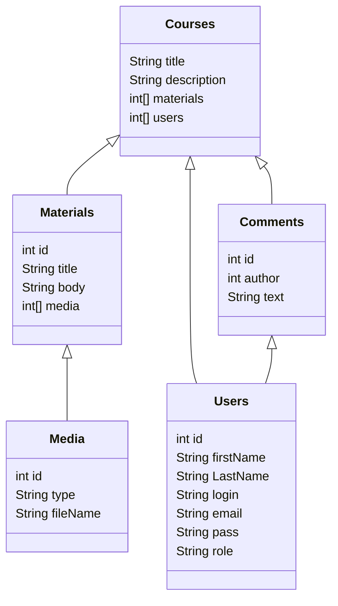

```mermaid
classDiagram
    Materials <|-- Media
    Courses <|-- Materials
    Courses <|-- Comments
    Courses <|-- Users
    Comments <|-- Users
    class Media {
        int id
        String type
        String fileName
    }
    class Materials{
        int id
        String title
        String body
        int[] media
    }
    class Courses{
        String title
        String description
        int[] materials
        int[] users
    }
    class Comments{
        int id
        int author
        String text
    }
    class Users {
        int id
        String firstName
        String LastName
        String login
        String email
        String pass
        String role
    }
```
  
